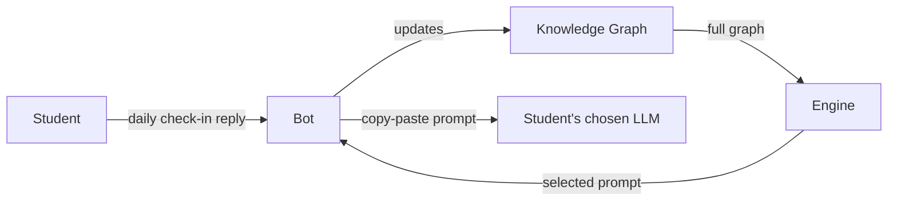

# Trellis

> An adaptive study-direction platform. It doesn't teach — it directs.

**Status:** 🚧 Early concept / pre-implementation. Architecture, schema, and stack are still being decided. Contributions/discussion welcome, but expect things to move fast and break.

---

## What is Trellis?

Trellis does not teach or explain content. Given a student's history, it determines exactly what they should study next, and hands them a single, precision-crafted prompt they can copy-paste into any LLM of their choice to actually learn it.

The core value isn't content generation — it's **judgment**: knowing, at any moment, what a specific student needs, and knowing what not to give them.

## How it works

Three components:

| Component | Role |
|---|---|
| **The Bot** | The only user-facing touchpoint. Sends daily check-ins (email / Telegram / in-app push), takes free-text input about what the student studied, and delivers the final prompt. Intentionally "thin" — no intelligence lives here. |
| **The Knowledge Graph** | Per-user persistent memory. Encodes topics studied, what's next, and what to explicitly avoid or defer. Updated continuously from Bot interactions. Never sent to an LLM in full. |
| **The Engine** | The decision layer. Selects the smallest, most relevant slice of a student's graph and composes it into a single study-direction prompt. Designed so prompt quality doesn't degrade as the graph grows — a week-1 user and a year-1 user should get comparably good output. |



## Explicit non-goals

- Trellis does **not** teach, explain, or generate learning content itself.
- It does **not** call an LLM on the student's behalf to produce learning material — the student always takes the prompt elsewhere.
- Anything not listed above is out of scope until deliberately added — see [Roadmap](#roadmap).

## Repository structure

```
/trellis
  /bot          # check-in delivery + free-text intake (channel integrations)
  /graph        # per-user knowledge graph: schema, storage, update logic
  /engine       # selection + prompt-composition logic
  /docs         # design notes, ADRs, platform description
```
*(Placeholder — will be updated as the first modules land.)*

## Tech stack

TBD — not yet locked in. Decisions will be logged in `/docs` as they're made.

## Roadmap

- [ ] Define Knowledge Graph schema (node shape, edge types, per-node state)
- [ ] Decide canonical vs. emergent graph structure
- [ ] Bot v0 — single channel (TBD which) for check-ins + prompt delivery
- [ ] Engine v0 — selection + composition pipeline
- [ ] Cost/latency benchmarking on the selection step
- [ ] User-facing graph view (transparency / correction)

## Contributing

Not formally open yet — this is a solo/early-stage project. Issues and discussion are welcome in the meantime.

## License

TBD.